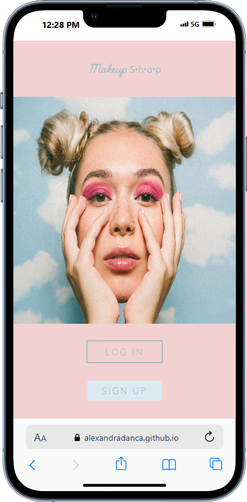
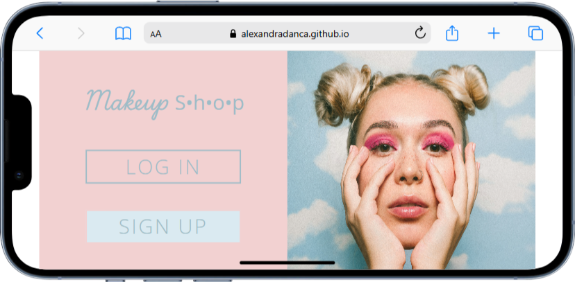

<h2 align="center">
 :lipstick: <a href="https://alexandradanca.github.io/-001-SignUpMakeupStore/" target="_blank">SignUpMakeupStore</a>
</h2>

This is a Sign Up page for MakeUp store.  It was created during front-end learning journey

## Built With
- HTML
- CSS

## Features
**📖 Multi-Page Layout**

**🎨 Styled just with CSS**

**📱 Fully Responsive**

<h2>Mockup Phone</h2>

 
  
  

<h2>Mockup mp4</h2>

https://github.com/user-attachments/assets/b32b3b93-a3ef-4dba-8f50-791541f4cc43

